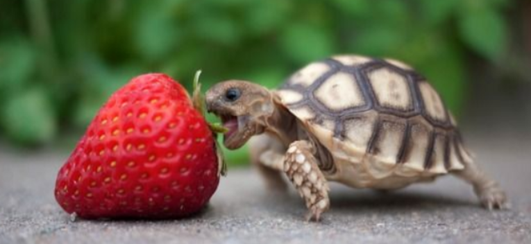
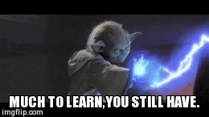

# Engineering_4_Notebook

## Table of Contents
* [Launch_Pad_Part_1](#Launch_Pad_Part_1)
* [Raspberry_Pi_Assignment_Template](#Raspberry_Pi_Assignment_Template)
* [Onshape_Assignment_Template](#Onshape_Assignment_Template)
---

## Launch_Pad_Part_1

### Assignment Description

This is the first assignment in a series where I build a simulated launch pad. In this section, I wrote a script to count down from 10 second to liftoff. 

### Evidence 

### Wiring

N/A

### Code.
[Link to code](https://github.com/millerm22/Engineering_4_Notebook/blob/main/Raspberry_Pi/hello_world.py). 

### Reflection

At first I had a hard time remembering the differences between the types of loops. A while loop runs until the condition is not longer satisfied, while a for loop runs for loop runs a specific number of times. A for loop was appropriate in this case, as I am always counting down from 10. I also had to look up the syntax for using the range function in a for loop. After some googling, I re-learned that the order is as follows: range(starting number, ending number, increment amount). 

&nbsp;

## Raspberry_Pi_Assignment_Template

### Assignment Description

Write your assignment description here. What is the purpose of this assignment? It should be at least a few sentences.

### Evidence 

Pictures / Gifs of your work should go here. You need to communicate what your thing does. 

### Wiring

This may not be applicable to all assignments. Anything where you wire something up, include the wiring diagram here. The diagram should be clear enough that I can recreate the wiring from scratch. 

### Code.
Give me a link to your code. [Something like this](https://github.com/millerm22/Engineering_4_Notebook/blob/main/Raspberry_Pi/hello_world.py). Don't make me hunt through your folders, give me a nice link to click to take me there! Remember to **COMMENT YOUR CODE** if you want full credit. 

### Reflection

What went wrong / was challenging, how'd you figure it out, and what did you learn from that experience? Your goal for the reflection is to pass on knowledge that will make this assignment better or easier for the next person. Think about your audience for this one, which may be "future you" (when you realize you need some of this code in three months), me, or your college admission committee!

&nbsp;

## Onshape_Assignment_Template

### Assignment Description

Write your assignment description here. What is the purpose of this assignment? It should be at least a few sentences.

### Part Link 

[Create a link to your Onshape document](https://cvilleschools.onshape.com/documents/003e413cee57f7ccccaa15c2/w/ea71050bb283bf3bf088c96c/e/c85ae532263d3b551e1795d0?renderMode=0&uiState=62d9b9d7883c4f335ec42021). Don't forget to turn on link sharing in your Onshape document so that others can see it. 

### Part Image

Take a nice screenshot of your Onshape document. 

### Reflection

What went wrong / was challenging, how'd you figure it out, and what did you learn from that experience? Your goal for the reflection is to pass on knowledge that will make this assignment better or easier for the next person. Think about your audience for this one, which may be "future you" (when you realize you need some of this code in three months), me, or your college admission committee!

&nbsp;

## Media Test

Your readme will have various images and gifs on it. Upload a test image and test gif to make sure you've got the process figured out. Pick whatever image and gif you want!

### Test Link
[Hyperlink text](raspberry-pi/test.py)

### Test Image

### Test GIF

